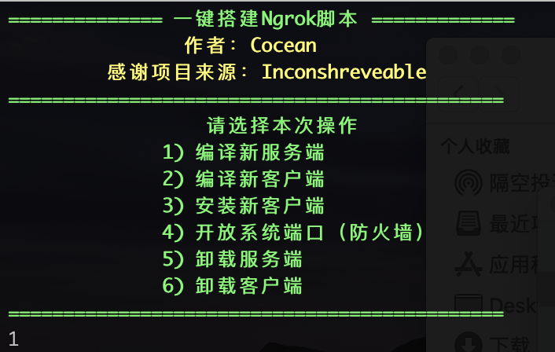
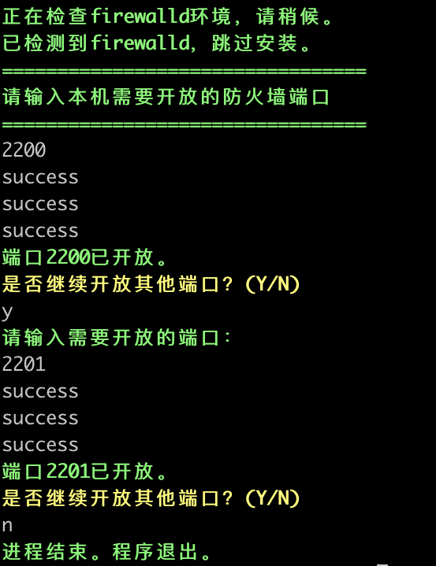
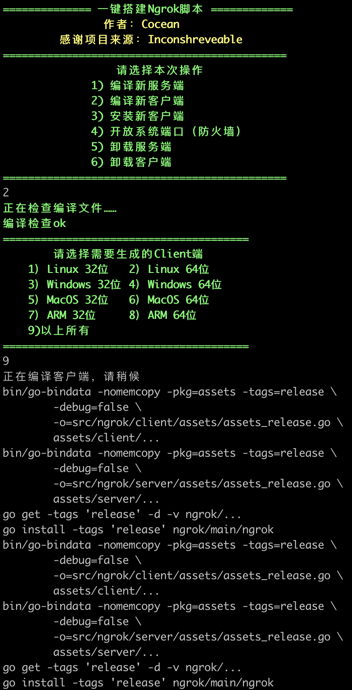
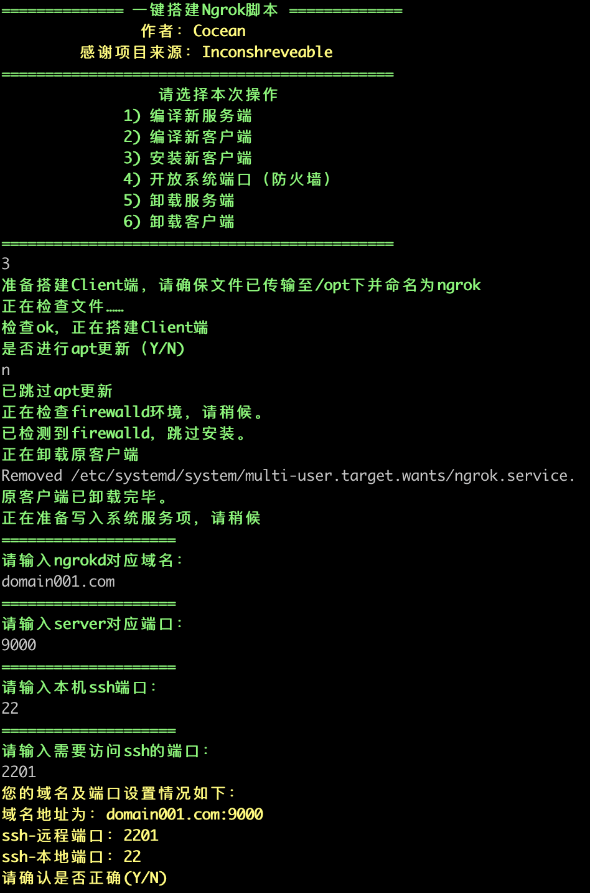
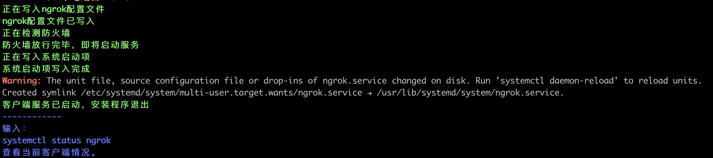
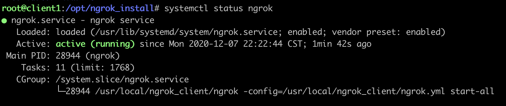

# Ngrok 一键安装脚本

## 简介

出于平常远程部署服务的需要，学习了ngrok。想要在家里访问公司的电脑，碍于不知道公司路由器的用户密码，无法使用端口转发。了解到内网穿透软件，看了一下价格都好高！

而且Ngrok官网提供的服务器速度较慢，日常卡的让我怀疑人生。也不够安全，经常一觉起来连接数就40+了，很是无奈。

于是就想，为何不自己搭建一个server呢？

刚好手头有闲置的Rasp，刷入Ubuntu测试server，发现连接后速度很快，安全性又高。


### 实现功能

- 自动部署Server端与Client端。

- 实现远程访问VPS及主机。Client端无需获取路由器权限，即可远程访问Client。（比如Client设备在公司，Server租的，那在家也能访问Client！）

- 服务将写入Systemd服务管理。
- 支持https。

- 穿透所有需要的端口。不同的端口对应不同服务。常用服务的端口如：

| 常用服务 | 对应端口 |
| -------- | -------- |
| FTP      | 21       |
| SSH      | 22       |
| Telnet   | 23       |
| SMTP     | 25       |

- 支持自定义端口穿透（需修改/usr/local/ngrok_client/ngrok.yml文件）。
- 支持amd与arm架构（主要目的是为了方便Rasp用户构建）。


### 有关本脚本

- 本脚本支持Debian及Ubuntu（amd与arm均支持）。CentOS暂不支持。

- Ngrok分为ngrok server （也就是ngrokd）和ngrok client。

  此处先建立ngrokd，然后通过ngrokd生成对应系统版本的client端应用程序。

  需要手动将client传输到client主机，才能执行搭建client的命令。


### 其他

目前发现一些功能无法解决，比如需要手动将ngrok client复制到目标服务器上。

该脚本仅用于学习交流，请勿用在生产环境。本人代码水平不高，欢迎批评指正！

本脚本基于inconshreveable的项目搭建，感谢大神开发：https://github.com/inconshreveable/ngrok


## 准备工作

### VPS配置

此处举例，共有1台server，2台Client，配置信息如下：

| 主机    | 芯片类型 | 系统   | 内核 | RAM  | ip            |
| ------- | -------- | ------ | ---- | ---- | ------------- |
| Server  | arm 64   | Ubuntu | 2G   | 4G   | 192.168.0.201 |
| Client1 | arm 64   | Ubuntu | 2G   | 4G   | 192.168.0.202 |
| Client2 | amd 64   | Debian | 4G   | 8G   | 192.168.0.203 |

查找芯片类型：

```shell
cat /proc/version
```

#### 请确保处于root权限下进行操作！


### 路由器配置

此处使用的是家用网络。需将路由器设置DMS主机，确保放行Server的所有端口。

若您使用的是阿里云等具有公网ip的VPS，请确保放行Server的所有端口。


### 域名解析

准备一个域名，几级都可以，不要浪费钱。此处示例为：domain001.com

将Server所在的ipv4地址解析到该域名。确保能ping通。


### 下载本脚本

将本脚本下载至Server、Client1和Client2：

```shell
wget --no-check-certificate https://raw.githubusercontent.com/Cocean001/ngrok_install/master/ngrok_install/ngrok_install.sh -O ngrok_install.sh
chmod +x ngrok_install.sh
```


## 运行脚本

### 搭建ngrokd

1）登录Server，运行脚本。

```shell
bash ngrok_install.sh
```



2）选择1，并根据提示操作。


### 开放端口

1）在Server下，运行脚本。选择4，并根据提示操作。

​	此处举例，我们将通过2221及2222端口，通过ssh，分别访问Client1与Client2。

​	为了方便对比，这里将路由器开放端口也一并放进来参照：

| 主机    | 路由器开放端口 | 主机开放端口（iptables等） |
| ------- | -------------- | -------------------------- |
| Server  | all            | 2221 & 2222                |
| Client1 | 无需开放端口   | 22                         |
| Client2 | 无需开放端口   | 22                         |




### 编译客户端

1）在Server内，运行脚本，选择2，并根据提示操作。



2）编译成功后，二进制客户端应用将存在以下目录：

```
/opt/ngrok
```

若该文件夹已存在，将以客户端生成日期及时间命名该客户端。

3）重要：手动将客户端传输到Client1与Client2的/opt/文件夹下，并命名为ngrok。


### 搭建Client

1）登录Client，运行脚本。选择3，并根据相应提示操作：





2）输入命令，查看服务情况：

```
systemctl status ngrok
```

若服务未运行，则再次执行（1），重新安装客户端即可成功。




## 连接

一般比较喜欢用ssh连接、管理服务器。

例如此处使用2201端口，通过domain001.com以root权限连接：

```shell
ssh root@domain001.com -p 2201
```


## Reference

本脚本基于inconshreveable的项目搭建：https://github.com/inconshreveable/ngrok

感谢大神开发开源！

其他参考：

https://www.jianshu.com/p/b81bb6a3c0b9

