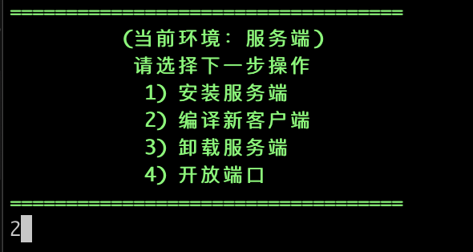
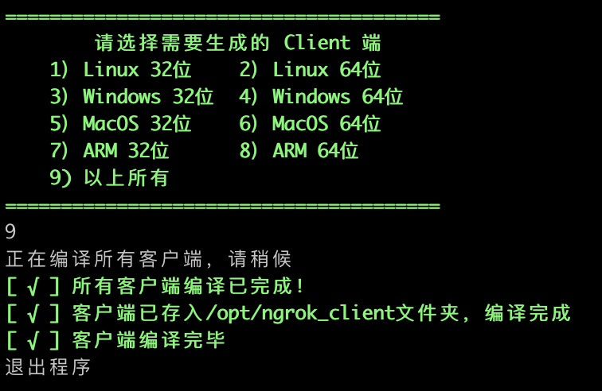

# Ngrok 一键安装脚本

## Change Log

### V 1.1.1 (2021/12/18)

#### 新增功能：

- 新增环境检测：系统版本检测、防火墙与工具包检测
- 网络环境检测：判断是否为科学上网，若不是则将github与go自动换源至国内可访问的ip（使用科学上网能加快安装速度）
- apt自动换源：根据系统类型将apt换源至对应的中科大源。

#### 界面优化：

- 部署目录界面优化。
- 新增进度条，可确认当前安装进度。

#### 修复bug：

- 修复已安装go但无法make的问题。
- 自动判断当前go版本，并安装对应go语言版本（前段时间发现由于部分限制，ngrok编译时在部分机型上仅支持go 1.12.6版本。本次更新将从google.cn上下载go 1.12.6 作为安装语言）。

### V 0.2.2 (2021/11/09)

- 修复一些bug

### V 0.2.1 (2021/01/09)

- 新增功能：合并客户端编译与安装脚本
- 新增功能：开放防火墙端口

### V 0.1.1 (2020/12/07)

- 服务端安装脚本生成

## 项目简介

出于平常远程部署与访问服务的需要，经常需要在家里访问公司的电脑。碍于不知道公司路由器的用户密码，无法使用端口转发。接触了内网穿透ngrok，发现可以满足需求。

但了解了一下市面上提供的内网穿透，发现两个硬伤：

1. Ngrok官网提供的服务器速度较慢，日常卡的让我怀疑人生。也不够安全，经常一觉起来连接数就40+了，很是无奈。
2. 国内有的几款ngrok服务器虽然速度和安全性都不错，但收费对精打细算的拮据学生党来说还是比较贵的。

于是就想，为何不自己搭建一个server呢？

经过一番研究，发现手头闲置的Rasp可以当作server。刷入Ubuntu后测试server，发现连接后速度很快、安全性也高。唯一的问题就是安装过程比较麻烦。于是写了这个脚本方便以后安装部署。

### 有关脚本

本脚本内功能分为服务端与客户端。目录逻辑如下：


### 脚本功能

- 自动部署 Ngrok Server 端与 Client 端。
- 自动卸载 Ngrok Server 端与 Client 端。
- 自动编译 Ngrok Client 端。
- 自动开放对应端口（可手动开放指定端口）
- 自动将服务写入 Systemd 服务管理。
- 支持自定义端口穿透（需修改/usr/local/ngrok_client/ngrok.yml文件）。
- 自动检查部署环境（必备工具包、网络环境等）

### 脚本支持

- 本脚本的server端部署：

  - 支持Debian及Ubuntu，暂不支持CentOS。
  - 支持arm32、arm64、amd的芯片架构。
- 本脚本的Client端部署：

  - 支持Debian及Ubuntu自动部署，CentOS、MacOS、Windows等系统需手动安装。
  - 支持所有芯片架构。

###

### 其他

该脚本仅用于学习交流，请谨慎用在生产环境。本人代码水平不高，欢迎批评指正！

本脚本基于inconshreveable的项目搭建，感谢大神开发：https://github.com/inconshreveable/ngrok

## 使用方式

### 下载脚本

github地址（推荐）

```shell
wget --no-check-certificate https://raw.githubusercontent.com/Cocean001/ngrok_install/master/ngrok_install/ngrok_install.sh -O ngrok_install.sh && chmod +x ngrok_install.sh
```

国内上网环境同学可使用gitee地址：

```shell
wget https://gitee.com/cocean001/ngrok_install/raw/master/ngrok_install.sh -O ngrok_install.sh && chmod +x ngrok_install.sh
```


English user could use this command to run the script of English version
``` shell
wget https://gitee.com/cocean001/ngrok_install/raw/master/ngrok_install_en.sh -O ngrok_install.sh && chmod +x ngrok_install.sh
```

### 运行

```shell
bash ngrok_install.sh
```

运行后根据提示选择相应操作即可。如有需要可阅读操作详细说明。

## 操作详细说明

注：该部分可跳过。脚本内绝大部分功能通过脚本内提示均可完成
根据ABCD顺序操作即可。
目录：
A）安装服务端
B）编译客户端
C）

### A) 安装服务端

#### 1] 准备工作

1. 准备一台服务器。
2. 准备一个已经解析到该服务器的域名，几级都可以，不要浪费钱。此处示例为：`testdomain.com`
3. （可选）运行脚本前，可手动确认：

   1. apt是否已更新：

      ```shell
      apt update -y
      apt upgrade -y
      apt-get update -y
      apt-get upgrade -y
      ```
   2. 确认以下工具已安装：

      | 序号 | 工具名    | 用途                   |
      | ---- | --------- | ---------------------- |
      | 1    | wget      | 用于下载安装go语言     |
      | 2    | curl      | 用于下载ngrok项目包    |
      | 3    | make      | 用于项目编译           |
      | 4    | firewalld | 用于开放防火墙端口     |
      | 5    | sudo      | 用于以root权限执行命令 |

      注：本脚本的防火墙操作将默认通过firewalld进行，若安装了ufw等管理工具可能冲突，请留意。

      ```shell
      apt install wget -y
      apt install curl -y
      apt install make -y
      apt install firewalld -y
      apt install sudo -y
      ```

   注：本步骤将可通过脚本自动操作，但容易报错，推荐使用手动确认。
4. （可选）配置当前网络环境至可以科学上网（科学上网可以有效提升安装速度）
5. 下载脚本
   github地址（推荐）

   ```shell
   wget --no-check-certificate https://raw.githubusercontent.com/Cocean001/ngrok_install/master/ngrok_install/ngrok_install.sh -O ngrok_install.sh && chmod +x ngrok_install.sh
   ```

   国内上网环境同学可使用gitee地址：

   ```shell
   wget https://gitee.com/cocean001/ngrok_install/raw/master/ngrok_install.sh -O ngrok_install.sh && chmod +x ngrok_install.sh
   ```
6. 运行脚本

   ```shell
   bash ngrok_install.sh
   ```

#### 2] 编译服务端

1. 选择 1【 服务端 】

   
2. 选择 1【 安装服务端 】

   
3. 输入y/n选择是否进行环境检查与apt更新（可跳过，但建议手动检查）

   
4. 等待go环境检测完成。

   
5. 输入已解析的域名信息
   

   此处测试域名为 `testdomain.com`，实际使用时直接替换成已准备的域名即可。
6. 安装项目包（脚本自动运行，无需操作）
   注：若系统检测到已有项目包，则会提示如下信息：

   

   可选：1）覆盖项目包。2）跳过下载。
7. 签发证书、编译服务端（脚本自动运行，无需操作）

   
8. 配置端口信息

   ngrok的server有3个端口需要配置：

   | 序号 | 协议                       | 默认端口号 |
   | ---- | -------------------------- | ---------- |
   | 1    | http                       | 80         |
   | 2    | https                      | 443        |
   | 3    | tunnel（如ssh、tcp等协议） | 4443       |

   

   选 1 之前请确认一下是否能开放80与443端口！！！

   选 1 之前请确认一下是否能开放80与443端口！！！

   选 1 之前请确认一下是否能开放80与443端口！！！

   几个目前了解到的开放80与443端口的信息：

   | 序号 | VPS类型 | 服务商  | 80端口             | 443端口            |
   | ---- | ------- | ------- | ------------------ | ------------------ |
   | 1    | 本地    | 移动    | 难申请             | 难申请             |
   | 2    | 本地    | 电信    | 可申请（需企业ip） | 可申请（需企业ip） |
   | 3    | 本地    | 联通    | 可申请             | 可申请             |
   | 3    | 云端    | 阿里云  | 可申请             | 可开放             |
   | 4    | 云端    | 腾讯云  | 可申请             | 可申请             |
   | 5    | 云端    | 海外VPS | 可开放             | 可开放             |

   说明：


   - 难申请：由于不是公网ip，几乎都无法开放任何端口（2021年12月多次咨询移动客服与技术人员得出的结论）。
   - 可申请：经实测默认关闭，可向云平台提交申请开放。
   - 可开放：经实测无需申请可直接开放。

   选择完后，直接输入自定义端口，选择y即可。服务将自动写入systemd并在后台运行。

   
9. 查看服务，确认是否已运行

   输入以下命令确认：

   ```shell
   systemctl status ngrokd
   ```

   

   跳出绿色的 `active(running)`即证明服务端已运行

### B) 编译客户端

1. 登录服务端，确保脚本已下载，并已完成A中的服务端编译。
2. 运行脚本，选择 1 【服务端】

   
3. 选择 2 【编译新服务端】

   
4. 根据提示选择需要编译的客户端类型

   

   此处生成的客户端，将存于 `/opt/ngrok_client/`下。需手动将客户端文件传输至客户端服务器。

   注：编译速度与服务器算力有关，可能需要较长时间，请耐心等待。

   

## C) 安装客户端

### 1] 准备工作

1. 在`Server`上完成客户端程序编译。
2. 将已编译好的客户端程序传输至`Client`。

---

注：以下部分在 `Client`端完成。

---

3. 将客户端程序命名为 `ngrok`，放在 `/opt`目录下。
4. 确认 `Client`系统类型，本脚本仅支持 Debian 与 Ubuntu 的自动部署。
5. 将脚本下载至 `Client`。

   github地址（推荐）

   ```shell
   wget --no-check-certificate https://raw.githubusercontent.com/Cocean001/ngrok_install/master/ngrok_install/ngrok_install.sh -O ngrok_install.sh && chmod +x ngrok_install.sh
   ```

   国内上网环境同学可使用gitee地址：

   ```shell
   wget https://gitee.com/cocean001/ngrok_install/raw/master/ngrok_install.sh -O ngrok_install.sh && chmod +x ngrok_install.sh
   ```

### 2] 安装客户端

1. 运行脚本，选择 2 【客户端】

   
2. 选择 1 【安装客户端】

   
3. 选择是否进行apt更新（可跳过）

   
4. 确认 Server 信息

   1. 输入访问域名
      此处需输入之前在 `Server`上编译时准备好的域名，无需解析到 `Client`上。这里的例子还是跟前面的一样，用 `testdomain.com`

      

      这里会出现报错信息：

      ```shell
      Failed to stop ngrok.service: Unit ngrok.service not loaded.
      Failed to disable unit: Unit file ngrok.service does not exist.
      rm: cannot remove '/usr/lib/systemd/system/ngrok.service': No such file or directory
      ```

      这段出现的原因是，原先系统内没有安装过ngrok client。很正常不必理会（todo：后期会想办法把它灭掉）
   2. 输入端口信息

      此处的端口即为之前在Server上填的协议与对应的端口。

      

      先后确认：访问协议、访问端口。

      Server上对应的协议和端口（默认）：

      | 序号 | 协议                       | 默认端口号 |
      | ---- | -------------------------- | ---------- |
      | 1    | http                       | 80         |
      | 2    | https                      | 443        |
      | 3    | tunnel（如ssh、tcp等协议） | 4443       |

      这里要填的 `访问协议`对应上表的[3] `tunnel`

      而这里的 `访问端口`即为上表中[3] 对应的端口 `4443`

      当然这些都可以自定义的
5. 确认 Client 信息

   此处需要确认以下信息：

   - 服务名：本地运行的服务名，随意填写。
   - 本地端口：本地服务所对应的端口。
   - 远程端口：远程访问的端口。就是想要通过公网访问的端口。

   此处可选自动与手动输入。自动输入时，将默认配置为：

   - 服务名：ssh
   - 本地端口：22
   - 远程端口：2001

   

   若选择手动输入，则需要分别配置以上信息。

   此处范例信息为：

   - 服务名：kubeapi
   - 本地端口：6443
   - 远程端口：16443

   

   输入完成后输入y确认
6. 完成！

   

   可输入以下命令，查看当前客户端状态：

   ```shell
   systemctl status ngrok
   ```

   

   当看到绿色的 `active (running) `即证明运行成功。

## D) 其他操作
### 1] 卸载服务端
   1. 选择 1 【服务端】

   

   2. 选择 3 【卸载服务端】

   其余根据提示操作即可

   

### 2] 删除客户端
   1. 选择 2 【客户端】

   

   2. 选择 3 【卸载客户端】
   
   其余根据提示操作即可

   

### 3] 开放防火墙端口
   1. 选择 1 【服务端】 或 2【客户端】均可
   
   2. 选择【开放端口】
   
   其余根据提示操作即可

   
   
 
## Reference

本脚本基于inconshreveable的项目搭建：https://github.com/inconshreveable/ngrok

感谢大神开发开源！

其他参考：

https://www.jianshu.com/p/b81bb6a3c0b9
